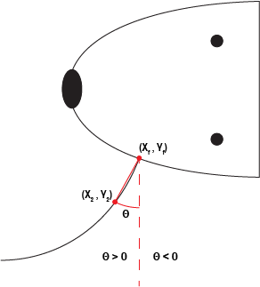
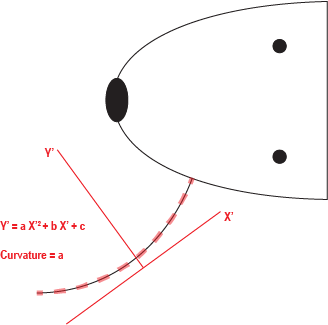

Kinematic and Mechanical Quantification
#########################################

Here we outline the different behavioral features of whisking that can be calculated from
whisker videos. We also provide background on how these are calculated in the WhiskerTracking.jl
package. Many of these features do not have consensus of how they should be calculated in the
literature, and we will try our best to highlight potential advantages and pitfalls to the
approaches that we have selected here.

Whisker Angle
--------------

The whisker angle is in a coordinate system where the axis perpendicular to the axis
of the head is equal to zero. More protracted (toward the nose) positions are positive,
while more retracted (toward the tail) are negative. The angle is calculated in this
coordinate system as the angle between a vector extending from the whisker follicle (|x_f| , |y_f|) to a
point along the whisker shaft (|x_2| , |y_2|), and the axis indicating 0 (dashed line).

Calculation
~~~~~~~~~~~~

.. math::

   \theta = \arctan{ \frac{ y_2 - y_f }{ x_2 - x_f } }

Potential Pitfalls and Alternative Approaches
~~~~~~~~~~~~~~~~~~~~~~~~~~~~~~~~~~~~~~~~~~~~~~

The coordinate system is defined as being perpendicular to the head, but the
head may not align to the x or y axis of the video.

The vector for the whisker segment is only defined by two points: at the follicle,
and some arbitrary distance from the follicle.  Errors in angular calculations
can result from errors in the positions of the follicle or the arbitrary point
(|x_2| , |y_2|).

The optimal distance from the follicle along the whisker, which ends at point
(|x_2| , |y_2|) is unknown. Because the whisker has some intrinsic curvature,
this will result in some error. Additionally, changes in curvature from
movement or active touch may result in changes in the angle, particularly if
the point is chosen a far distance from the whisker follicle.

Whisker Curvature
------------------

:underline:`Estimation of curvature for a rodent whisker is nontrival.`  The quantity of
curvature is most accurately estimated by an osculating circle. Indeed, some
groups have calculated curvature by finding the best fit circle, and then
using the inverse of the radius to calculate curvature [CITE]. However, this
approach is complicated by the fact that a whisker as a whole does not form the
shape of a circle, and that whiskers tend to not have significant amounts of bending
(particularly whisker segments), so that the whisker itself will represent only
a very small part of a very large fitted circle, leading to poor fits.

Whisker Phase
--------------

.. |x_f| replace:: x\ :sub:`f`\
.. |y_f| replace:: y\ :sub:`f`\
.. |x_2| replace:: x\ :sub:`2`\
.. |y_2| replace:: y\ :sub:`2`\
